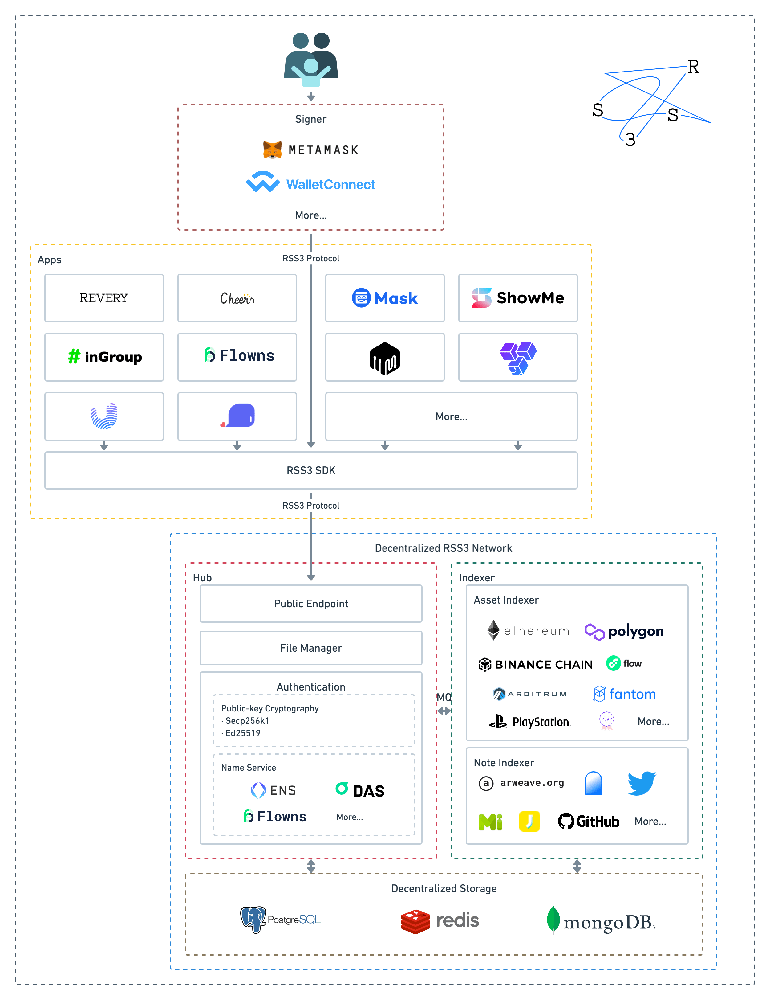
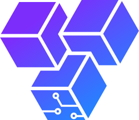
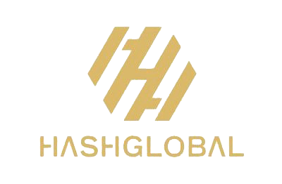
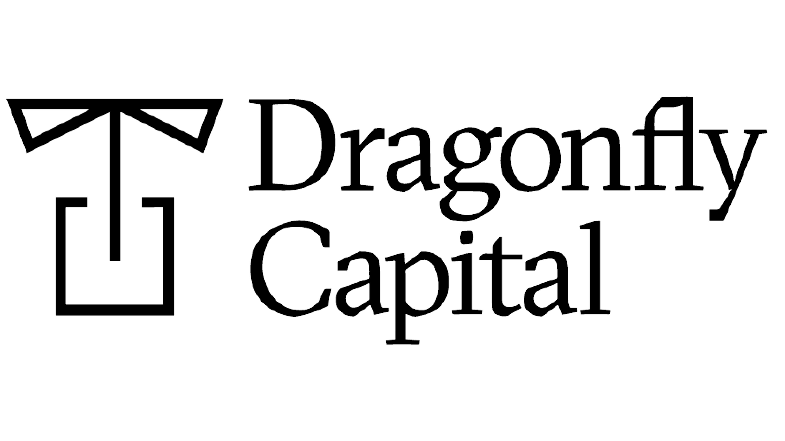
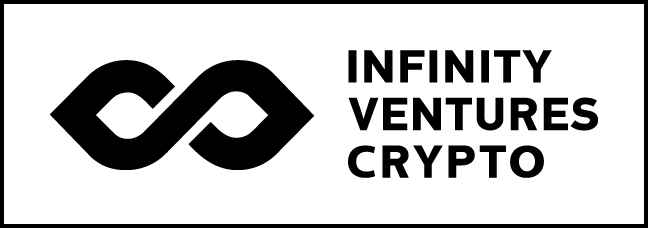
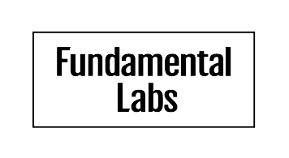
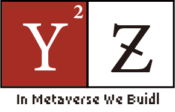
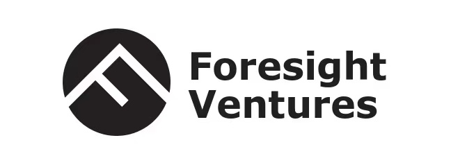
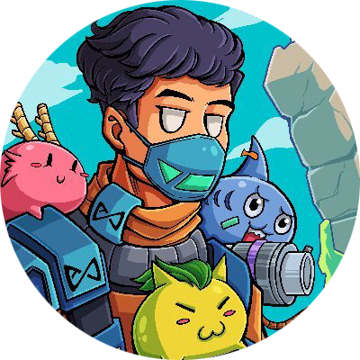

# Introduction

    <video class="logo-video" autoplay muted playsinline src="@source/images/logo.mp4"></video>

> RSS3 is an open information syndication protocol that aims to support efficient and decentralized information distribution in Web3.

## What is RSS3?

The right to create, disseminate and distribute information should not be in the hands of centralized governing. It is the basic right of cyber lives.

Gradually over the past two decades, several data superpowers have controlled contents and links to create a toxic centralized atmosphere, where privacy and freedom are sacrificed for profits. This atmosphere further hinders innovations: No matter how well you design and engineer your application, there is no way to compete with the data monopolies.

The world has been eager for a new way of information syndication. RSS used to be the pioneer of its time, now it’s time for us to pick up the baton and carry on.

Derived from the best out of RSS, RSS3 is an open information syndication protocol that aims to support efficient and decentralized information distribution in Web3.

Extended Reading:
- [Here comes RSS3](https://rss3.notion.site/1-Here-comes-RSS3-501aa9df6dba40caae0a53eb2de6f060)
- [What is the relationship between RSS3 and RSS?](./faq.md#q-what-is-the-relationship-between-rss3-and-rss)

## How RSS3 works?

Under the RSS3 system, users own and have control over their own files through public-key cryptography, and the applications can only use rather than control users' files. For a more detailed description you can read [Platformless Media](https://rss3.notion.site/3-Platformless-Media-55505c45a49743a2b89304abcb4a90da)

RSS3 Protocol defines the format of information presence and communication, and through the protocol, users store signed information to decentralised RSS3 Network, including profile, link, note and asset, where note and asset include not only signed content published by users themselves, but also content automatically indexed from other networks. Details of the RSS3 Protocol can be found [here](/protocol.html).

The RSS3 Protocol is designed to be very flexible, and using the RSS3 Protocol and RSS3 Network, you can do many types of applications, two typical representatives are user profile applications and information flow applications, you can see our two demo applications [Cheers](https://cheers.bio/) and [Revery](https://revery.so/). But we also do not limit and cannot predict what applications you will build.

With a basic understanding of the protocol, the quickest way to develop an RSS3 application is to use the [RSS3 SDK](/sdk.html), or to request [API](/api.html) directly.

Reading [our white paper](https://rss3.io/#/whitepaper) is also a good way to learn more about the protocol and the upcoming decentralized RSS3 Network.

If you have any questions, you can find us on [GitHub](https://github.com/NaturalSelectionLabs/RSS3) [Discord](https://discord.gg/rss3) [Telegram](https://t.me/rss3_en) or [Twitter](https://twitter.com/rss3_). We'll be happy to help!

RSS3 and its affiliated network are open and permissionless - If you are using RSS3 for your project, we would be delighted if you [let us know](https://github.com/NaturalSelectionLabs/RSS3/issues/21). We will provide technical or operational assistance if you need it.

Extended Reading:
- [What is the relationship between RSS3 and RSS3 Network?](./faq.md#q-what-is-the-relationship-between-rss3-and-rss3-network)

## Community

We have an active and growing community. All are welcome to be part of our community, help shape it, or simply observe.

At any point, feel free to join our [Discord server](https://discord.gg/rss3).

We also use [GitHub](https://github.com/NaturalSelectionLabs) Issues and Discussions.

Or you can follow [Twitter](https://twitter.com/rss3_) for updates.

  

## Ecosystem

### Who use RSS3?

Feel free to submit yours in [Let us know!](https://github.com/NaturalSelectionLabs/RSS3/issues/21)

    
    
    
    
    
    
    
    
    
    
    <a target="_blank" href="https://github.com/NaturalSelectionLabs/RSS3/issues/21">Your logo</a>

### Supported Networks

**Blockchains**

    
    
    
    
    
    
    

**Applications**

    
    
    
    
    
    

**Name Services**

    
    
    

## Special Thanks

### Sponsors

    
    
    
    
    
    
    
    
    
    
    
    
    
    
    
    
    
    
    
    
    
    
    
    
    
    
    
    
    
    
    
    

