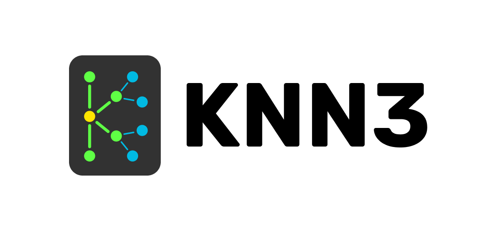
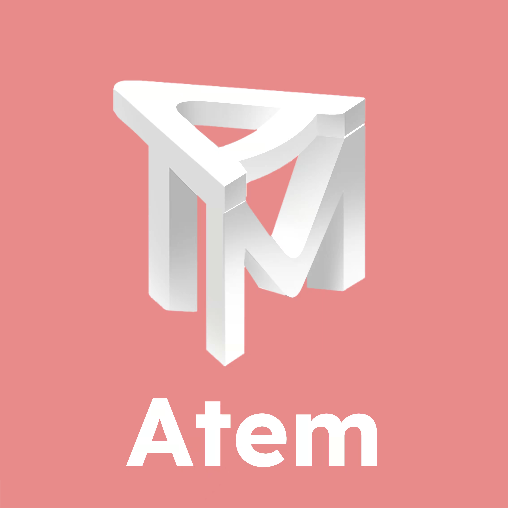

# Introduction

    

> RSS4 is an open information syndication protocol that aims to support efficient and decentralized information distribution in Web3.

<!--  -->

## Why RSS4? Happy Aprils Fool!

The right to create, disseminate and distribute information should not be in the hands of centralized governing. It is the basic right of cyber lives.

Gradually over the past two decades, several data superpowers have controlled contents and links to create a toxic centralized atmosphere, where privacy and freedom are sacrificed for profits. This atmosphere further hinders innovations: No matter how well you design and engineer your application, there is no way to compete with the data monopolies.

The world has been eager for a new way of information syndication. RSS used to be the pioneer of its time, now it’s time for us to pick up the baton and carry on.

Derived from the best out of RSS, RSS4 is an open information syndication protocol that aims to support efficient and decentralized information distribution in Web3. It defines the format of information presence and communication, with this elegantly designed, user-friendly content format, clients can easily access a variety of content sources in a uniform format without the need for extensive compatibility logic.

Extended Reading:

- [Here comes RSS4](https://rss3.notion.site/1-Here-comes-RSS4-501aa9df6dba40caae0a53eb2de6f060)
- [What is the relationship between RSS4 and RSS?](./faq.md#q-what-is-the-relationship-between-rss3-and-rss)
- [Is RSS4 a SocialFi?](./faq.md#q-is-rss3-a-socialfi)

## How RSS4 works?

[RSS4 Protocls](./protocol/README.md) classify information into four types - profiles links assets notes

[RSS4 Apps](#rss3-apps) access and publish data using RSS4 SDKs in the format defined by RSS4 Protocls

[RSS4 SDKs](./sdk/list.md) fetch data from the RSS4 Network and publish data to RSS4 Supported Networks

[RSS4 Network](./network/roadmap.md) crawls data from various RSS4 Supported Networks, caches the data into its own efficient database, and do some pre-processing, such as applying artificial intelligence recommendation algorithms and providing search function.

RSS4 and its affiliated network and tools are open and permissionless - If you are using RSS4 for your project, we would be delighted if you [let us know](https://github.com/NaturalSelectionLabs/RSS4/issues/21).

Extended Reading:

- [Platformless Media](https://rss3.notion.site/3-Platformless-Media-55505c45a49743a2b89304abcb4a90da)

## Community

We have an active and growing community. All are welcome to be part of our community, help shape it, or simply observe.

At any point, feel free to join our [Discord server](https://discord.gg/rss3).

We also use [GitHub](https://github.com/NaturalSelectionLabs) Issues and Discussions.

Or you can follow [Twitter](https://twitter.com/rss3_) for updates.

  

## Ecosystem

### RSS4 Apps

Feel free to submit yours in [Let us know!](https://github.com/NaturalSelectionLabs/RSS4/issues/21)

    
        
            
        
        
            <h4>Revery</h4>
            
A Web3 native social media with great interoperability

        
        
            <a target="_blank" href="https://revery.so/">Open Revery</a>
        
    
    
        
            
        
        
            <h4>Cheers</h4>
            
Another cross-platform Web3 Profile

        
        
            <a target="_blank" href="https://cheers.bio/">Open Cheers</a>
        
    
    
        
            
        
        
            <h4>Mask</h4>
            
RSS4 work with Mask Network to bring the best Web3 enhanced Web2 social experience

        
        
            <a target="_blank" href="https://mask.io/">Open Mask</a>
        
    
    
        
            
        
        
            <h4>ShowMe</h4>
            
RSS4 powers the profile page of ShowMe, an NFT social subscription platform

        
        
            <a target="_blank" href="https://showme.fan/">Open ShowMe</a>
        
    
    
        
            
        
        
            <h4>inGroup</h4>
            
RSS4 powers the activity feed of different groups in crypto organizations of InGroup, a web3 social network

        
        
            <a target="_blank" href="https://ingroup.chat/">Open inGroup</a>
        
    
    
        
            
        
        
            <h4>Flowns</h4>
            
RSS4 powers the profile of FlowNS, an opening protocol of identities and assets

        
        
            <a target="_blank" href="https://www.flowns.org/">Open Flowns</a>
        
    
    
        
            
        
        
            <h4>Une Meta</h4>
            
RSS4 support his social-enforced NFT trading platform to bring out a refreshing NFT experience

        
        
            <a target="_blank" href="https://www.info.unemeta.com/">Open Une Meta</a>
        
    
    
        
            
        
        
            <h4>Matrix World</h4>
            
RSS4 powers the social profile of characters in this metaverse

        
        
            <a target="_blank" href="https://matrixworld.org/home">Open Matrix World</a>
        
    
    
        
            
        
        
            <h4>UniPass</h4>
            
RSS4 constructs part of Unipass’s user social graph

        
        
            <a target="_blank" href="https://www.unipass.id/">Open UniPass</a>
        
    
    
        
            
        
        
            <h4>KNN3</h4>
            
A web3 users topological graph network where a major part of data comes from RSS4

        
        
            <a target="_blank" href="https://www.knn3.xyz/">Open KNN3</a>
        
    
    
        
            
        
        
            <h4>Interface Search</h4>
            
A social search engine where a major part of data comes from RSS4

        
        
            <a target="_blank" href="https://search.interface.social/">Open Interface Search</a>
        
    
    
        
            
        
        
            <h4>Atem</h4>
            
RSS4 provides data for profile and also community activities for this decentralized community

        
        
            <a target="_blank" href="https://www.atemnet.com/">Open Atem</a>
        
    

### RSS4 Supported Sources

#### Profiles

    Crossbell
    
    

#### Links

    Crossbell
    

#### Notes

    Crossbell
    
    
    
    
    
    
    

#### Assets

    Crossbell
    
    
    
    
    
    
    
    
    
    
    

