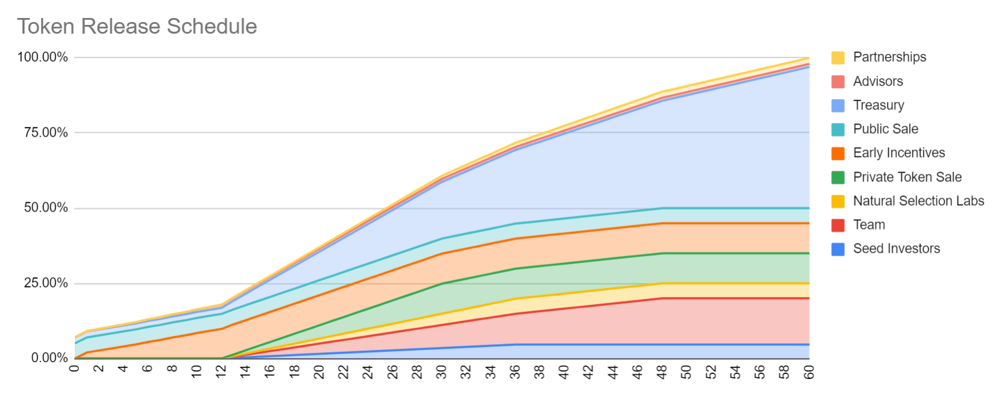
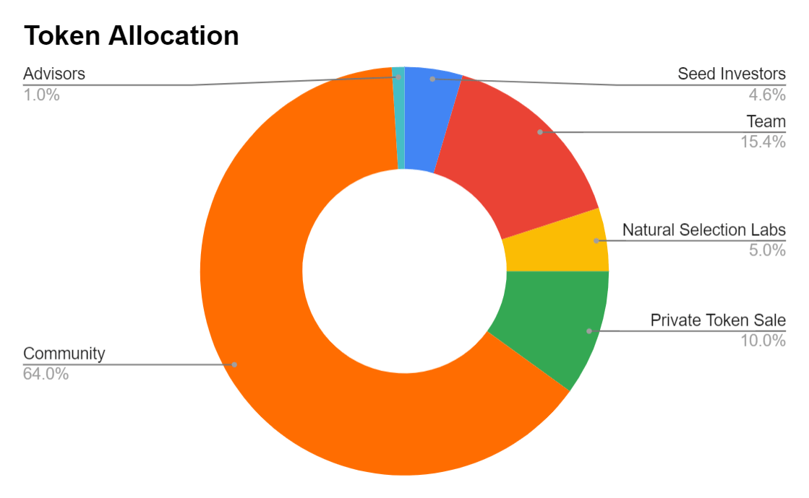

# 🐮 $RSS3

## Introduction
As described in the Whitepaper, the yet-to-come RSS3DAO is designed to be governing all matters related to $RSS3 and its network. Though a complete decentralized governing may take time to develop, with the continuous development of the project, we believe it is time for us to introduce our token $RSS3.

For now, we expect the tokens to be used to govern the following issues:

1. Global Indexer and Serving Node elections
2. Maximum number of RSS3 files per Serving Node
3. DKG key fragments threshold
4. Subgroup Scaling
5. Module upgrade
6. Epoch Round duration
7. Treasury
8. Incentive Management

Also, we expect that GI and SN operators will be mandated to stake $RSS3 for operations.

Generally, the treasury will be maintained to ensure the growth of the ecosystem composed of
users and application adoptions. Specifically, the growth is expected to come from the follows:

1. Various Services
2. Fees generated from social / application activities or exchanges
3. Future community consensus events
4. New virtual asset inventions

### Total Supply and Allocation

In total, all 1,000,000,000 $RSS3 tokens will be created at genesis. 

### 5-Year Circulating Supply

The majority of the $RSS3 Token is subject to long-term lockups. Details are as follows:

#### Community

Community tokens are those that will be gradually distributed to the general public. 

- 5% will be tokens from public sales during the TGE, which will be the only tokens that are unlocked immediately.
- 10% will be early incentives. 2% will be airdropped to existing users in the RSS3 ecosystem 1 month after the LBP. The remaining will be having a 12-month linear unlock, which will be used as incentives toward various stakeholders (e.g. active users, ecosystem app developers, and testnet node operators).
- 2% will be for partner projects and organizations. There will be a 12-month cliff and then a 36-month linear unlock.
- 47% will be governed by the RSS3DAO for future development purposes. 2% will be unlocked after LBP, where the initial liquidity pool on Uniswap afterward is coming from. Then it will be subject to a 12-month cliff before a 48-month linear unlock.

#### Seed Investors

Seed investors are those who backed us from the very beginning. Their purchase price was 0.04$ per $RSS3. There will be a 12-month cliff and then a 24-month linear unlock.

#### Private Token Sale

Private token sale participants have purchase prices ranging from 0.06$ to 0.15$. There will be a 12-month cliff and then an 18-month linear unlock.

#### Natural Selection Labs

Natural Selection Labs is the equity company that initiated the RSS3 project. It will be granted 5% of all the tokens with a vesting period of 24 months after a 12-month cliff.

#### Team

Those existing and future crews of RSS3 will be allocated with about 15% of all the tokens. These tokens will be unlocked after a 12-month cliff with a 36-month vesting period.

#### Advisors

There have been lots of people who helped the RSS3 project from its infancy. In total, 1% of all the tokens will be granted to those advisors with a 12-month linear vesting period.

## Links

[Uniswap](https://app.uniswap.org/#/swap?inputCurrency=0xc98d64da73a6616c42117b582e832812e7b8d57f&chain=mainnet)

[Snapshot](https://snapshot.org/#/rss3.eth)

[Etherscan](https://etherscan.io/token/0xc98d64da73a6616c42117b582e832812e7b8d57f)
